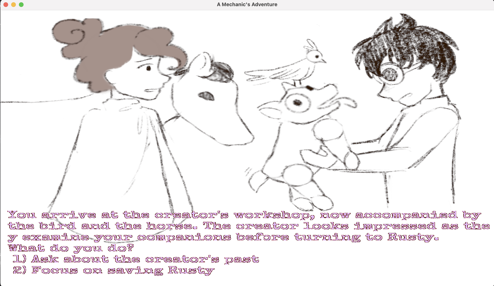

# A Mechanic's Adventure

Author: Flora Cheng

Design: It's a story based game, where you choose the main character's choices by pressing the corresponding numbers, with an original story!
<!-- (TODO: In two sentences or fewer, describe what is new and interesting about your game.) -->

Text Drawing: 
<!-- (TODO: how does the text drawing in this game work? Is text precomputed? Rendered at runtime? What files or utilities are involved?) -->
Text is precomputed, where using the freetype library, all the characters are loaded into a vector. Then when a text needs to be displayed, each character is referenced and then drawn on screen.

Choices: 
<!-- (TODO: how does the game store choices and narrative? How are they authored? Anything nifty you want to point out?) -->
Choices are managed by a vector of storypoints, each of which containing it's own possible choices and which storypoint it leads to from there.

Screen Shot:

How To Play:

<!-- (TODO: describe the controls and (if needed) goals/strategy.) -->
Read your options and select your choice with the corresponding number!

Sources: 
<!-- (TODO: list a source URL for any assets you did not create yourself. Make sure you have a license for the asset.) -->
font: https://fonts.google.com/specimen/Special+Elite   Using the Apache License, Version 2.0.

This game was built with [NEST](NEST.md).

